<div align="center">


# eflink-wiki

**面向中小团队的开源企业级知识库**

块编辑器 · 多人实时协同 · 五模块嵌入 · 细粒度权限 · 私有化部署

[](LICENSE)


[在线 Demo](https://wiki-demo.eflink.tech) · [部署文档](#-生产部署) · [商业支持](#-商业支持) · [联系我们](#-联系我们) · [报告问题](mailto:support@eflink.tech)

</div>

---

## ✨ 简介

eflink-wiki 是对标 ONES Wiki / Confluence 核心体验的独立知识库系统，支持私有化部署到企业内网单台服务器，运行期零外部依赖（自带用户体系 + 独立数据库）。

仓库分三部分：

- **`backend/`**：Kotlin + Spring Boot 3.3 + JDK21 + jOOQ + MySQL 8，命令模式架构（wiki-core / wiki-contract / wiki-store / wiki-app 四模块），默认端口 **8090**
- **`frontend/`**：React 19 + TypeScript + Vite + Tailwind CSS + zustand，块编辑器（Tiptap），复用 `@eflink-tech/{word,excel,pptx,draw,mindmap}` 编辑器包
- **`collab-server/`**：Node 22 + Hocuspocus + Yjs，多人实时同页编辑（在线光标/断线恢复），默认端口 **18080**

## 📸 产品截图

| 工作台 | 块编辑器 |
|---|---|
| 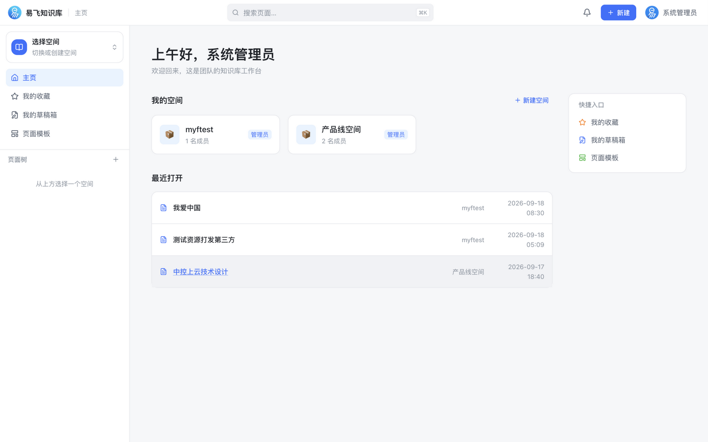 | 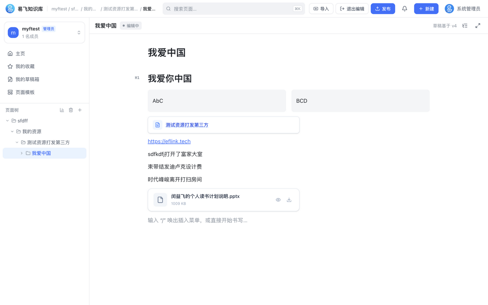 |
| **斜杠插入菜单（20+ 内容块）** | **页面阅读视图（嵌入块 + 附件预览）** |
| 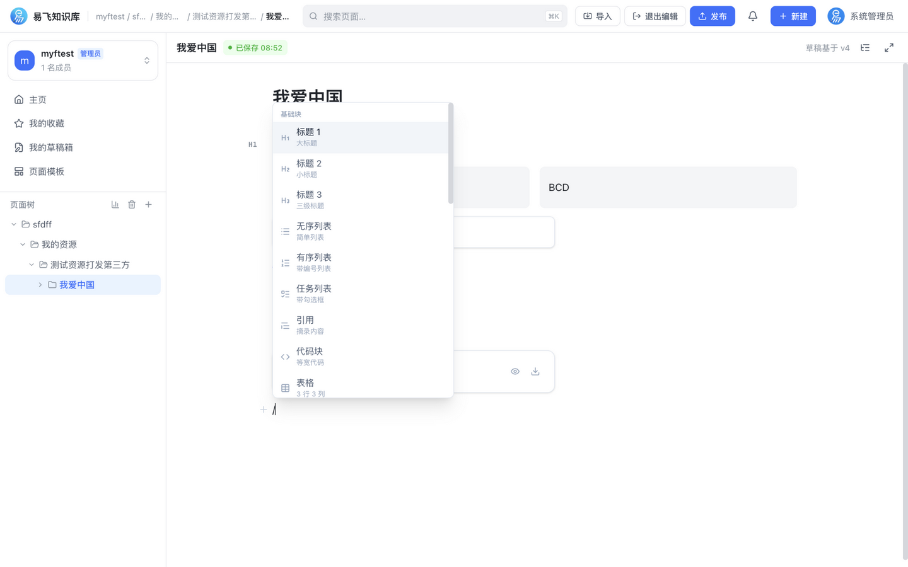 | 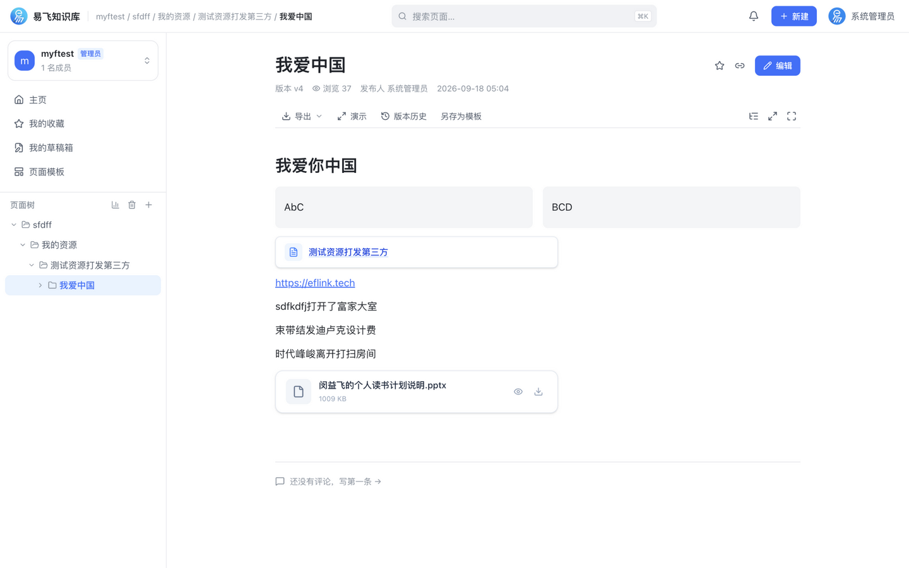 |
| **空间成员与权限管理** | **空间数据统计** |
| 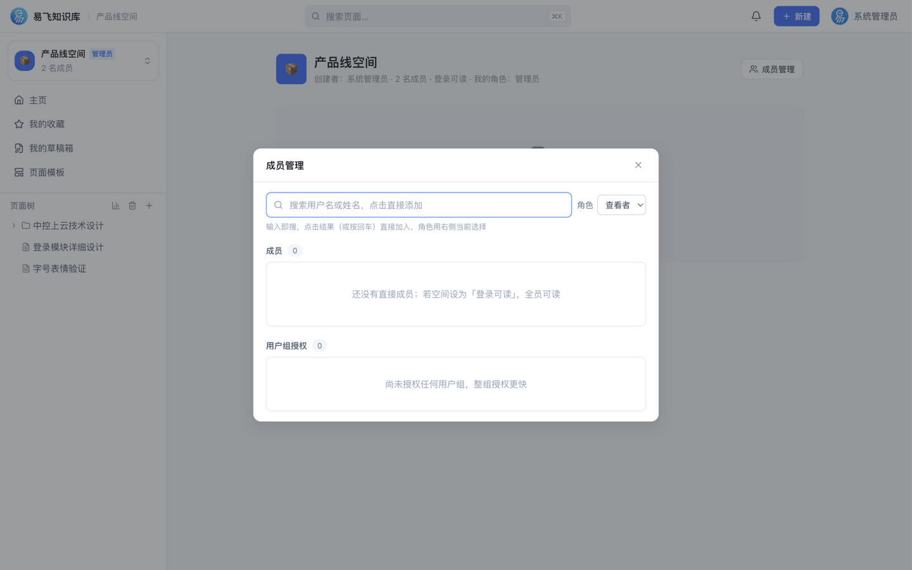 | 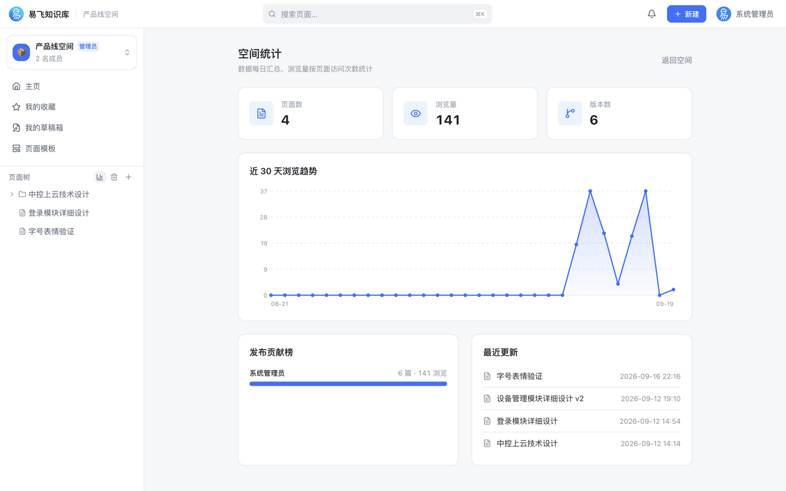 |

<details>
<summary>更多截图</summary>

| 空间页面树 | 全文检索 |
|---|---|
| 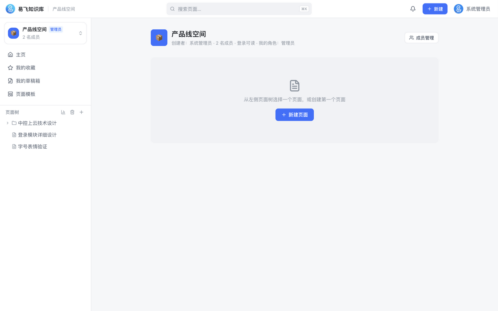 | 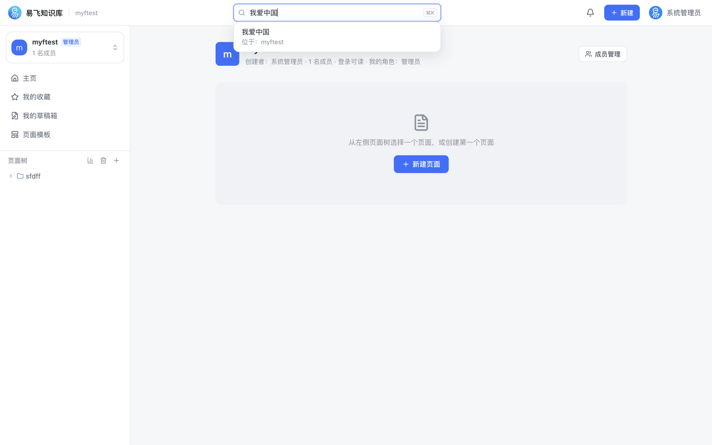 |
| **版本历史与回滚** | **页面模板** |
| 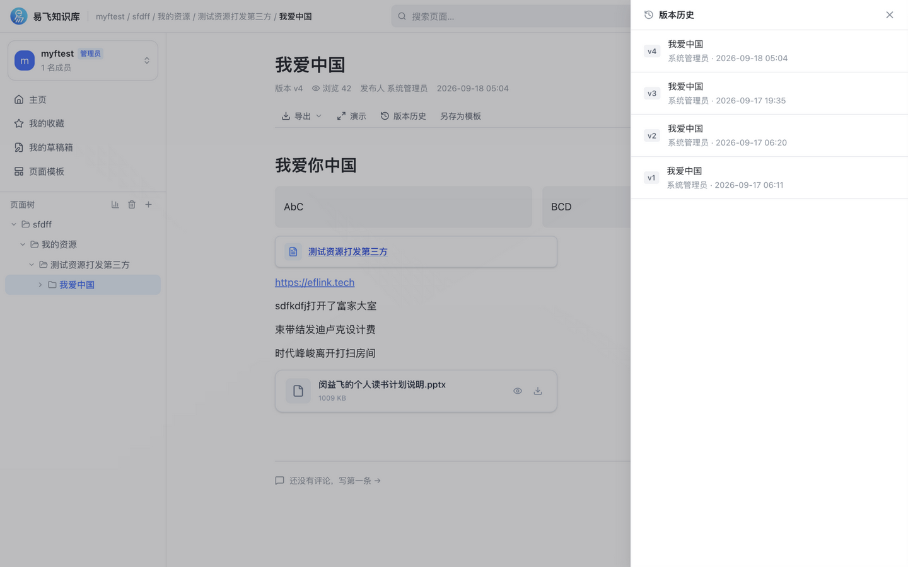 | 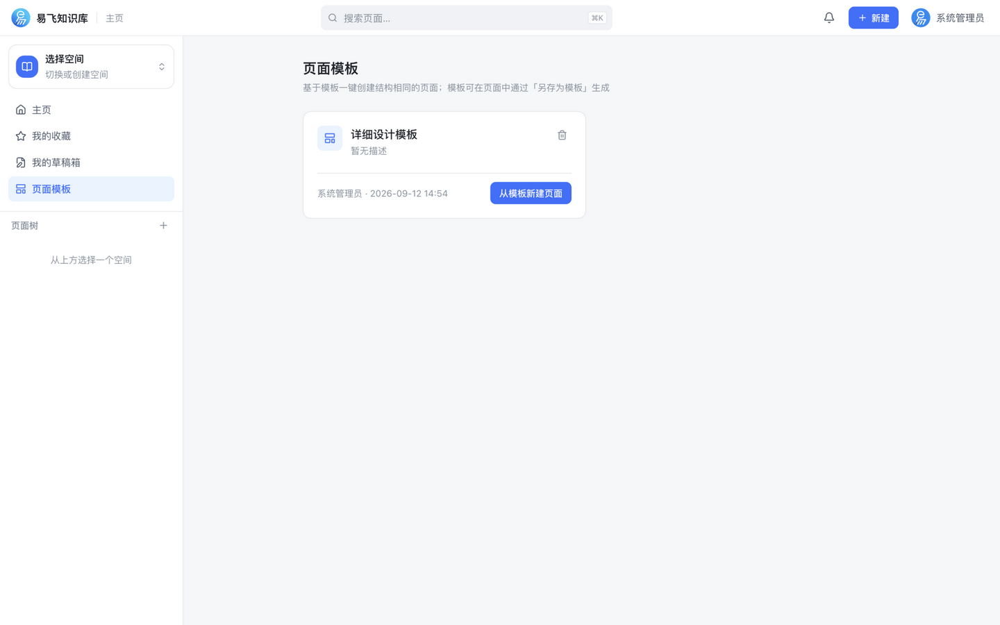 |
| **管理后台用户管理** | **版本对比 diff** |
| 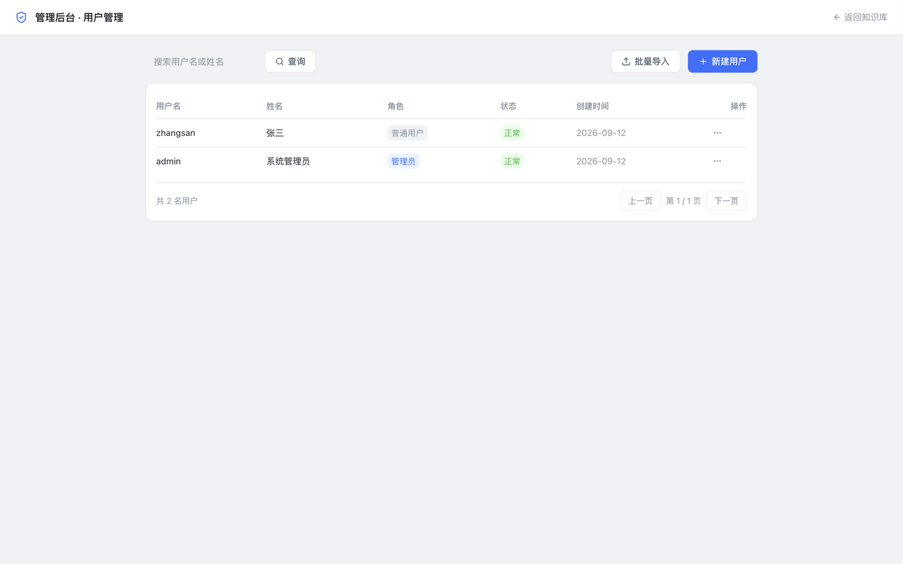 | 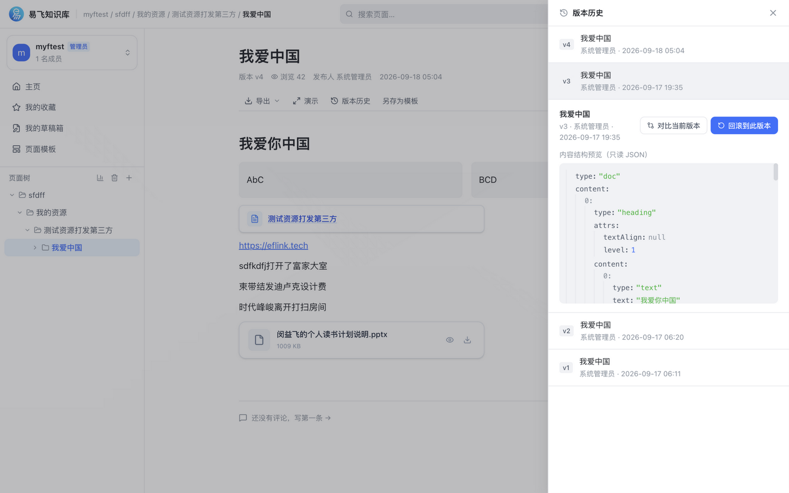 |

</details>

## ✅ 核心能力

- **页面**：块编辑器（标题/表格/任务列表/代码块高亮/图片/附件/音视频/网页内嵌/五模块嵌入块 word·excel·pptx·draw·mindmap）、草稿-发布双态、版本历史（行级 diff + 回滚）、页面模板、Markdown/HTML 粘贴导入、Markdown/Word/PDF 导出、回收站
- **协作**：多人实时同页编辑（Yjs，在线成员彩色光标）、评论（楼中楼 + @成员）、@提及（空间成员，发布差量通知）、收藏、最近打开、站内通知（顶栏铃铛）、钉钉/飞书/企业微信机器人推送
- **附件在线预览**：docx / xlsx / pptx / pdf / 图片 / 视频 / 音频 / 文本，浏览器内直接查看
- **权限**：系统角色（管理员/普通用户）+ 空间成员三级角色（管理员/编辑者/查看者）+ 用户组按组授权（LDAP 部门组登录自动同步）+ 空间可见性（私有/登录可读）
- **企业集成**：LDAP/AD 登录、Open API（`/open/v1`，X-API-Key）、Webhook（HMAC-SHA256 签名）、Meilisearch 全文检索（可选）、License 授权
- **存储**：本地磁盘 / 七牛云对象存储（私有桶签名 URL，附件落独立子目录）

## 🚀 快速开始（开发模式）

### 1. 准备数据库

```sql
CREATE DATABASE `eflink-wiki` DEFAULT CHARACTER SET utf8mb4 COLLATE utf8mb4_unicode_ci;
```

默认连接 `127.0.0.1:3306/eflink-wiki`，账号默认 `root / 123456`（通过环境变量 `SPRING_DATASOURCE_USERNAME` / `SPRING_DATASOURCE_PASSWORD` 覆盖为你本地的数据库账号），Flyway 首次启动自动执行全部迁移（V1→V7）。

### 2. 启动后端（8090）

```bash
cd backend
./gradlew :wiki-app:bootRun
# 需协同编辑时，配置与 collab-server 的共享密钥（生产务必换掉默认值）：
# WIKI_INTERNAL_KEY=<你的密钥> ./gradlew :wiki-app:bootRun
```

### 3. 启动协同服务（18080，可选）

```bash
cd collab-server
npm install
WIKI_INTERNAL_KEY=<与后端一致的密钥> npm start
```

### 4. 启动前端（5173）

```bash
cd frontend
pnpm install && pnpm dev        # /api 与 /collab 自动代理到本地后端
```

### 5. 初始化管理员

浏览器打开前端会进入 `/setup` 引导页创建管理员（或 `POST /api/setup`），之后在管理后台创建其他账号。
接口文档（Swagger）：http://127.0.0.1:8090/springdoc/docs.html

> 改了数据库表结构后：`./gradlew :wiki-store:generateJooq` 重新生成 jOOQ 代码（生成物提交入库）。

## 📦 生产部署

### 一键部署脚本（推荐）

参考 eflink-frontend / eflink-backend 同款模式：本地构建 → scp 上传 → 远程停旧/换包/启动/健康检查。

```bash
cp scripts/deploy.env.example scripts/deploy.env   # 填写服务器地址与密钥（此文件已 gitignore）
./scripts/deploy-backend.sh                         # 后端：构建 JAR + 上传 + 重启 + 健康检查
./scripts/deploy-collab.sh                          # 协同服务：上传源码 + 远端 npm ci + 重启
./scripts/deploy-frontend.sh                        # 前端：构建 + 上传 + 备份旧版 + reload nginx
# 或一次全量（--skip-collab 可跳过协同服务）：
./scripts/deploy-all.sh
```

脚本行为细节：

- 后端/collab 重启只按部署路径与端口精确匹配旧进程，不影响同机其他服务；替换前自动备份 `.bak`，失败可直接回退
- 三个组件共用一份远端 env（`wiki.env`，由脚本从 `deploy.env` 的非空项生成，权限 600），服务重启时加载
- 前端部署自动备份旧版本（`.bak.tar.gz`），按提示可一键回滚

### 环境要求

| 组件 | 版本要求 | 用途 |
|---|---|---|
| JDK | 21+ | 后端 jar |
| MySQL | 8.0+（含 ngram 插件，官方版自带） | 业务库，Flyway 自动建表 |
| Node.js | 22+ | 协同服务 collab-server；前端构建 |
| pnpm | 10（`packageManager` 已固定） | 前端依赖与构建 |
| nginx | 1.18+ | 托管前端 + 反代 API/WS |

> ⚠️ 不要用 pnpm 12+ 安装前端依赖：它会把 tiptap v3 扩展的 peer 错配到 v2 core，构建报 `Missing export`。
> 前端在本地构建后上传，服务器不需要 Node 构建环境。

### 手动部署（理解脚本做的事）

#### 出包

```bash
bash scripts/build-frontend.sh     # → frontend/dist-release/  静态站点
bash scripts/build-backend.sh      # → backend/dist-release/eflink-wiki-server.jar
```

#### systemd 托管后端

```ini
[Unit]
Description=eflink-wiki backend
After=network.target mysql.service

[Service]
User=wiki
EnvironmentFile=/etc/eflink-wiki/env
ExecStart=/usr/bin/java -jar /opt/eflink-wiki/eflink-wiki-server.jar
Restart=always

[Install]
WantedBy=multi-user.target
```

#### 启动协同服务

```bash
cd collab-server && npm ci
WIKI_INTERNAL_KEY=<与后端一致> \
WIKI_BACKEND=http://127.0.0.1:8090 \
COLLAB_PORT=18080 \
node node_modules/tsx/dist/cli.mjs src/index.ts
```

> 未部署协同服务时编辑自动退化为单人模式（草稿链路不变），其余功能不受影响；nginx 里删掉 `/collab` 段即可。

#### 部署前端

把 `frontend/dist-release/` 内容放到 nginx 站点根目录（如 `/var/www/eflink-wiki/`），nginx 配置参考 [`deploy/nginx.conf.example`](deploy/nginx.conf.example)。关键点：

- `/collab` 反代 18080，必须带 `Upgrade`/`Connection` 头（WebSocket）
- `/api/` `/open/` `/uploads/` 反代 8090，`client_max_body_size 50m`
- `/index.html` 与 `/version.json` 禁缓存，`/assets/` 长缓存
- `/` 走 SPA 回退 `try_files $uri $uri/ /index.html`

前后端**分域部署**（前端与 API 不同 Origin）时额外要求：

- 构建前端前设置 `VITE_API_BASE=https://api.example.com/api`
- 后端 `wiki.cors.origins` 填前端 Origin（同域反代则两者都不需要）

## ⚙️ 配置参考

全部配置在 `backend/wiki-app/src/main/resources/application.yml`，优先用环境变量覆盖。

### 必改项（生产）

| 配置 | 环境变量 | 说明 |
|---|---|---|
| `wiki.jwt.secret` | `WIKI_JWT_SECRET` | JWT 签名密钥，≥32 字节随机串（`openssl rand -base64 48`） |
| `wiki.collab.internal-key` | `WIKI_INTERNAL_KEY` | 后端 ↔ collab-server 共享密钥（两端一致） |
| 数据源 | `SPRING_DATASOURCE_URL` / `SPRING_DATASOURCE_USERNAME` / `SPRING_DATASOURCE_PASSWORD` | 生产库连接（URL 含 `&`，写入 env 文件时务必加引号） |

### 对象存储（可选，默认本地磁盘）

```yaml
wiki:
  storage:
    type: qiniu          # local 本地磁盘（./data/uploads）/ qiniu
    qiniu:
      access-key / secret-key   # 七牛 AK/SK（经 QINIU_ACCESS_KEY / QINIU_SECRET_KEY 环境变量注入，勿提交）
      bucket: eflink            # 存储空间
      domain: https://oss.xxx.com   # CDN 域名
      zone: huanan              # huadong/huabei/huanan/beimei/xinjiapo
      private-bucket: true      # 私有桶：返回服务端签名 URL（默认 10 年有效期）
      key-prefix: wiki/         # 独立子目录
```

支持的环境变量：`QINIU_ACCESS_KEY` `QINIU_SECRET_KEY` `QINIU_BUCKET` `QINIU_DOMAIN` `QINIU_ZONE` `QINIU_PRIVATE_BUCKET` `QINIU_PRIVATE_URL_DEADLINE` `QINIU_WIKI_KEY_PREFIX`。
私有桶的签名逻辑在服务端完成，附件在线预览走后端同源代理（`/api/file-proxy`，登录 + 域名白名单），无需给 CDN 配 CORS。

### 通知推送（可选）

```yaml
wiki:
  notify:
    base-url: https://wiki.example.com   # IM 推送消息里的页面链接前缀
    dingtalk:
      webhook: https://oapi.dingtalk.com/robot/send?access_token=xxx
      secret: SECxxx                     # 机器人「加签」安全设置时填写
    feishu:
      webhook: https://open.feishu.cn/open-apis/bot/v2/hook/xxx
    wecom:
      webhook: https://qyapi.weixin.qq.com/cgi-bin/webhook/send?key=xxx
```

对应环境变量：`WIKI_BASE_URL` `DINGTALK_WEBHOOK` `DINGTALK_SECRET` `FEISHU_WEBHOOK` `WECOM_WEBHOOK`。
不配置则只发站内通知；评论/@提及 事件会自动推送到已配置的机器人，多个渠道同时配置时全部推送。

### 企业目录 LDAP（可选）

```yaml
wiki:
  auth:
    mode: ldap                # local 本地账号（默认）/ ldap 企业目录
    ldap:
      host / port / use-ssl
      base-dn: dc=example,dc=com
      bind-dn-template: uid={0},ou=people,{baseDn}   # {0} 为登录名
      group-attr: memberOf    # 登录时同步部门组（用户组 source=2）；置空关闭
```

LDAP 用户首次登录自动建号；其所在部门组自动同步为用户组，空间管理员可把整组授权进空间。

### 其他可选项

| 配置 | 说明 |
|---|---|
| `wiki.captcha-enabled` | 登录图形验证码开关（默认 false） |
| `wiki.search.engine` | `mysql`（ngram，默认）/ `meilisearch`（配 `wiki.search.meili.*`） |
| `wiki.cors.origins` | 前后端分域时填前端 Origin；同域反代留空 |
| `wiki.embed.back-href` | 业务系统集成时嵌入编辑器的返回跳转 |
| `WIKI_COLLAB_PORT`（仅 dev） | 前端代理协同 WS 的目标端口 |

## 🔄 版本升级

1. 备份 MySQL；Flyway 启动时自动执行增量迁移（V1→V7+）
2. 重新出包：`bash scripts/build-all.sh`
3. 替换 jar / 静态文件，重启后端与 collab-server
4. 前端发新版本后，已打开页面会轮询 `/version.json` 弹出「发现新版本」，点击刷新即可

## 💰 商业支持

本项目按 **MIT 协议永久开源**：允许免费商用、修改与二次分发（仅需保留版权声明），我们不设置任何功能限制与授权门槛，动手能力强的团队可照本文档自行搭建。

如果你希望省心落地、把环境与升级交给我们，提供以下可选付费服务：

| 服务 | 价格 | 内容 |
|---|---|---|
| **自建部署服务** | **¥1,999 / 次** | 远程部署至你的服务器（云主机 / 物理机均可）· Nginx / MySQL 8 / Node 环境检查与调优 · HTTPS 证书配置与域名接入 · 管理员使用培训（1 次）· 交付部署文档与后续自助运维指引 |
| **年度维护服务** | **¥999 / 年** | 新版本升级协助与数据安全保障 · 故障排查与技术答疑 · 使用问题优先响应 · 每年 1 次系统健康巡检 |

## 📮 联系我们

- **邮箱**：[support@eflink.tech](mailto:support@eflink.tech)（问题反馈 / 功能建议 / 部署与维护服务咨询）
- **GitHub**：[github.com/eflink-tech](https://github.com/eflink-tech)，欢迎 Star / Issue / PR
- **企业微信**：扫码添加，反馈问题、交流建议与获取支持

<p align="center">
  
</p>

## 🗺️ Roadmap

- [x] 后端：账号体系（初始化引导/登录/JWT+refresh/管理后台用户管理/Excel 批量导入/审计日志）
- [x] 后端：空间/成员/页面树/草稿/发布/版本/版本回滚/回收站/收藏/搜索/上传/评论/嵌入块数据/模板/统计 接口
- [x] 前端：Tiptap 块编辑器（标题/列表/任务列表/引用/代码块/表格/图片/`/`插入菜单）
- [x] 草稿/发布双态（自动保存、未发布修改提示、放弃草稿）+ 版本历史（详情/行级 diff/回滚）
- [x] 五模块嵌入块：word/excel/pptx/draw/mindmap，卡片插入 + 全屏编辑 + 阅读态内联只读渲染
- [x] 附件在线预览（docx/xlsx/pptx/pdf/图片/视频/音频/文本），后端同源代理解决私有桶跨域
- [x] P1 页面：评论（楼中楼）、成员管理、数据统计、回收站、草稿箱、页面模板、审计日志、Markdown 导入导出
- [x] P2 已交付：License 授权、LDAP 对接 + 部门组同步、用户组按组授权、Open API、Webhook、Meilisearch、演示模式
- [x] 通知体系：站内信（铃铛/未读/已读）+ 钉钉/飞书/企业微信机器人推送
- [x] @提及：编辑器与评论 @ 空间成员，发布差量通知
- [x] 实时协同编辑：collab-server（Hocuspocus + Yjs），多人同页 + 在线光标 + 快照持久化恢复
- [x] 出包脚本：`scripts/build-frontend.sh` / `scripts/build-backend.sh` / `scripts/build-all.sh`（默认前后端独立产物；`--embedded` 单 jar）

计划中：

- OIDC 对接（预留标准对接位；需要外部 IdP，如 Keycloak/钉钉/飞书）
- 分享链接（免登录/密码/有效期）、页面级权限
- 知识库 AI 问答（RAG）、标签体系、页面树拖拽
- Confluence / Notion 批量迁移导入

## 🤝 参与贡献

欢迎提交 Issue 与 Pull Request：

1. Fork 本仓库并创建特性分支（`git checkout -b feat/your-feature`）
2. 提交前跑通构建：后端 `./gradlew build`，前端 `pnpm build`
3. 提交信息遵循 `feat: / fix: / docs:` 前缀 + 中文描述
4. 发起 PR 并描述改动点与验证方式

详细设计见 [docs/知识库管理系统方案.md](docs/知识库管理系统方案.md)。

## 📄 License

[MIT](LICENSE) © 2026 闵益飞 (https://eflink.tech)
